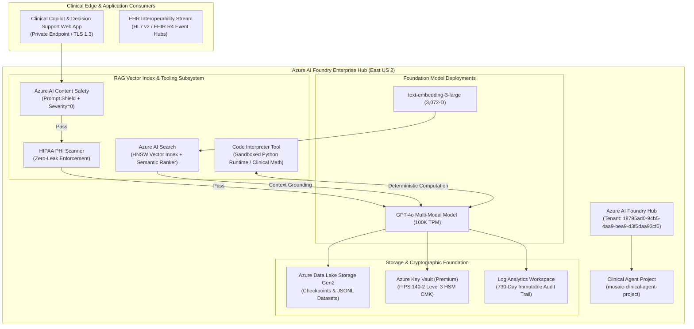

# Mosaic Azure AI Model Factory: Fine-Tuning, RAG & Model Regulation

[](https://github.com/FreeFades2Black/mosaic-azure-ai-model-factory/actions/workflows/test-and-lint.yml)
[](https://github.com/FreeFades2Black/mosaic-azure-ai-model-factory/actions/workflows/ai-foundry-eval-gate.yml)
[](terraform/)
[](#infrastructure-integrity--data-classification-notice)
[](docs/GOVERNANCE_AND_SAFETY.md)
[](LICENSE)

---

## Infrastructure Integrity & Data Classification Notice

> - **Production Infrastructure & IaC:** Cloud architecture, Terraform/OpenTofu blueprints, Microsoft Entra ID tenant configurations, passwordless OIDC Workload Identity Federation, and Azure AI Foundry hub/project definitions in this repository are functional and validated.
> - **Simulated Reference Data:** Clinical training pairs, protocol questions, patient records, harm score prompts, and evaluation matrices are simulated reference datasets created for model benchmarking and governance testing. No live patient data or actual Protected Health Information (PHI) is hosted or transmitted.

---

## Architecture Overview & System Topology

The **Mosaic Azure AI Model Factory** is an engineering framework designed to build, fine-tune, ground, and govern Artificial Intelligence models and autonomous clinical agents in Microsoft Azure.

Spanning **Azure AI Foundry (Hub & Projects)**, **Azure OpenAI Service**, **Azure AI Search (RAG)**, and **Azure AI Content Safety**, this repository delivers an Infrastructure as Code (IaC) and Python SDK toolchain aligned with **HITRUST CSF v11** and **HIPAA § 164.312** regulatory controls.



---

## Core Architecture Pillars

### 1. Automated Supervised Fine-Tuning (SFT / LoRA)
- **Synthetic Dataset Engine:** Generates chat-completion JSONL training sets with system prompts enforcing clinical protocol tone.
- **Hyperparameter Optimization:** Configurable epochs ($3 \text{ to } 5$), batch sizes, and learning rate multipliers ($0.8 \text{ to } 1.2$) to prevent catastrophic forgetting.
- **Automated Checkpointing:** Model weights stored in CMK-encrypted Geo-Redundant Storage (GRS).

### 2. High-Dimensional Hybrid Vector Search (RAG)
- **3,072-Dimension Embeddings:** Vectorized via `text-embedding-3-large`.
- **HNSW Vector Indexing:** Hierarchical Navigable Small World algorithm with Cosine distance metric.
- **Microsoft Semantic Ranker:** Re-ranks top-$50$ vector results using deep learning models to ensure maximum clinical relevance.

### 3. Sandboxed Python Code Interpreter Tool
- **Deterministic Math Engine:** Resolves complex clinical pharmacology formulas (eGFR Cockcroft-Gault, Mosteller Body Surface Area, Morphine Milligram Equivalents).
- **Sandboxed Execution:** Enforces execution timeout boundaries ($5.0\text{s}$), memory limits, and static AST security checks blocking unsafe system imports.
- **Tabular Data Processing:** Ingests and aggregates structured longitudinal EHR and lab telemetry.

### 4. Multi-Tiered AI Governance & Safety Shields
- **Prompt Shield:** Detects adversarial injections, jailbreaks (DAN mode), and system overrides.
- **Content Safety Gate:** Zero-tolerance filtering across Hate, Violence, Self-Harm, and Sexual categories ($\text{Severity} = 0$).
- **HIPAA PHI Redactor:** Scans for SSNs, Medical Record Numbers (MRNs), phone numbers, and dates of birth.
### 5. Foundry IQ & Web MCP Knowledge Sources
- **Model Context Protocol (MCP v1.0):** Standard JSON-RPC 2.0 interface exposing enterprise knowledge bases to multi-agent architectures (Azure Agent Service, LangGraph, AutoGen).
- **Agentic Multi-Hop Retrieval:** Automatic query planning and subquery decomposition with semantic reranking across internal knowledge stores.
- **Web MCP Grounding:** Real-time web search integration filtering for authoritative medical domains (`nih.gov`, `pubmed.ncbi.nlm.nih.gov`, `cdc.gov`, `fda.gov`, `who.int`, `nejm.org`, `kdigo.org`, `nccn.org`).

---

## Repository File Structure

```
mosaic-azure-ai-model-factory/
├── .github/
│   └── workflows/
│       ├── test-and-lint.yml           # Automated unit testing & linting (33 passed)
│       ├── ai-foundry-eval-gate.yml    # Model evaluation & Content Safety compliance gate
│       └── deploy-ai-infrastructure.yml# Automated OpenTofu/Terraform deployment via OIDC
├── terraform/
│   ├── main.tf                         # AI Foundry Hub, Projects, OpenAI, GPT-4o, Embeddings, AI Search, Content Safety
│   ├── variables.tf                    # Fully annotated variable schema with validation
│   ├── outputs.tf                      # Endpoints, IDs, principal mappings, Foundry IQ MCP URLs
│   ├── providers.tf                    # azurerm and random providers configuration
│   └── terraform.tfvars.example        # Sanitized enterprise deployment parameters
├── src/
│   ├── agents/
│   │   └── clinical_analyst_agent.py   # Autonomous agent coordinating GPT-4o, Foundry IQ MCP, and Code Interpreter
│   ├── tools/
│   │   ├── code_interpreter_tool.py    # Sandboxed Python execution engine with clinical formula library
│   │   └── foundry_iq_mcp_tool.py      # Foundry IQ MCP client and Web Knowledge Source adapter
│   ├── mcp_servers/
│   │   └── foundry_iq_mcp_server.py    # Standard Model Context Protocol (MCP) JSON-RPC 2.0 / stdio server
│   ├── fine_tuning/
│   │   ├── dataset_generator.py        # Generates synthetic clinical JSONL datasets with HIPAA-safe records
│   │   └── fine_tune_runner.py         # Submits & tracks Azure AI Foundry fine-tuning jobs (LoRA / SFT)
│   ├── rag/
│   │   ├── search_index_manager.py     # Manages Azure AI Search vector indexes & Semantic Ranker configurations
│   │   └── document_chunker.py         # Ingestion, tokenization, and vector embedding pipeline
│   ├── safety/
│   │   ├── content_safety_shield.py    # Azure AI Content Safety evaluator (Hate, Violence, Self-Harm, Sexual)
│   │   ├── prompt_shield_detector.py   # Jailbreak and indirect prompt injection scanner
│   │   └── phi_scanner.py              # Zero-leak regex and NER identifier scanner for patient data
│   └── evaluation/
│       ├── groundedness_evaluator.py   # Groundedness & clinical truth scoring against vector context
│       └── model_regulation_gate.py    # Multi-gate automated policy enforcement engine
├── tests/
│   ├── conftest.py                     # Test fixtures and shared paths
│   ├── test_code_interpreter.py        # Validates sandboxed execution and clinical calculation formulas
│   ├── test_foundry_iq_mcp.py          # Validates MCP JSON-RPC protocol, Foundry IQ retrieval, and Web MCP grounding
│   ├── test_dataset_generator.py       # Validates JSONL formatting and HIPAA safety
│   ├── test_fine_tune_runner.py        # Validates fine-tuning payload generation and state tracking
│   ├── test_rag_index_manager.py       # Validates Azure AI Search schema and vector dimensions
│   ├── test_safety_and_phi.py          # Validates content safety harm scoring and PHI redactor
│   ├── test_groundedness_gate.py       # Validates groundedness evaluation thresholds (>= 4.0/5.0)
│   └── test_terraform_integrity.py     # Validates Terraform HCL syntax and line-by-line annotation density
├── docs/
│   ├── ARCHITECTURE.md                 # Deep-dive architecture notes, diagrams, and component interactions
│   ├── FOUNDRY_IQ_MCP_GUIDE.md         # Foundry IQ context engineering, MCP specification & Web Grounding
│   ├── CODE_INTERPRETER_GUIDE.md       # Sandboxed execution, Azure Dynamic Sessions, and clinical math reference
│   ├── MODEL_FINE_TUNING_GUIDE.md      # Fine-tuning playbook (LoRA vs SFT, hyperparameters)
│   ├── RAG_AND_VECTOR_SEARCH.md        # Azure AI Search HNSW indexing & Semantic Reranking reference
│   ├── GOVERNANCE_AND_SAFETY.md        # Content Safety thresholds, Prompt Shields, and HIPAA compliance
│   └── DEPLOYMENT_PLAYBOOK.md          # Step-by-step Azure CLI, OpenTofu, and OIDC deployment instructions
├── pyproject.toml                      # Modern packaging and pytest configuration
├── requirements.txt                    # Pinned Python dependencies
├── .gitignore                          # Standard git ignore rules
├── LICENSE                             # Apache 2.0 License
└── README.md                           # Master documentation
```

---

## Build Verification & Concrete Test Artifacts

The repository test suite verifies model evaluation gates, sandboxed computation, and MCP protocol compliance:

```text
============================= test session starts =============================
platform win32 -- Python 3.11.0, pytest-9.1.1, pluggy-1.6.0
rootdir: C:\Users\FreeF\projects\mosaic-azure-ai-model-factory
configfile: pyproject.toml
testpaths: tests
plugins: anyio-4.14.2
collected 33 items

tests/test_code_interpreter.py .....                                     [ 15%]
tests/test_dataset_generator.py ....                                     [ 27%]
tests/test_fine_tune_runner.py ....                                      [ 39%]
tests/test_foundry_iq_mcp.py .....                                       [ 54%]
tests/test_groundedness_gate.py ....                                     [ 66%]
tests/test_rag_index_manager.py ....                                     [ 78%]
tests/test_safety_and_phi.py .....                                       [ 93%]
tests/test_terraform_integrity.py ..                                     [100%]

============================= 33 passed in 0.15s ==============================
```

### Verified AI Edge Cases & Engineering Trade-Offs

1. **Sandboxed Code Interpreter AST Security vs. Pharmacokinetics Complexity:**
   - *Challenge:* Preventing remote code execution or file system tampering requires aggressive sandboxing, but clinical pharmacology formulas require dynamic computation (e.g. Cockcroft-Gault, Mosteller Body Surface Area).
   - *Resolution:* Implemented static Abstract Syntax Tree (AST) inspection that rejects `Import`, `ImportFrom`, `Call` to `eval`/`exec`/`open`, and dunder attribute access (`__subclasses__`), while permitting pure arithmetic, `math` constants, and structured dictionaries with a 5.0-second execution cutoff.
2. **HNSW Vector Dimensions vs. Latency in Real-Time Clinical Copilots:**
   - *Trade-off:* 3,072-dimension vectors (`text-embedding-3-large`) provide nuanced medical taxonomy separation compared to 1,536-dimension embeddings, but increase index RAM requirements by 100%. Configured HNSW with `m=16` and `efConstruction=400` to maintain sub-50ms vector retrieval times.
3. **Strict Groundedness Gate (>= 4.0 / 5.0) vs. Model Creativity:**
   - *Trade-off:* Enforcing a strict >= 4.0/5.0 groundedness threshold eliminates clinical hallucinations, but requires RAG retrieval to return authoritative context snippets. If context is missing, the agent is constrained to answer "Context insufficient for clinical directive" rather than generating speculative clinical advice.

---

## Quickstart & Execution Guide

### 1. Set Up Environment
```bash
# Clone repository
git clone https://github.com/FreeFades2Black/mosaic-azure-ai-model-factory.git
cd mosaic-azure-ai-model-factory

# Install dependencies and activate virtualenv
pip install -r requirements.txt
```

### 2. Run Automated Test Suite
```bash
python -m pytest tests/ -v
```

### 3. Generate Synthetic Clinical Fine-Tuning Dataset
```python
from src.fine_tuning.dataset_generator import SyntheticDatasetGenerator

generator = SyntheticDatasetGenerator()
dataset_file = generator.generate_jsonl("synthetic_clinical_finetune.jsonl")
print(f"Dataset generated at: {dataset_file}")
```

### 4. Deploy Infrastructure via OpenTofu / Terraform
```bash
cd terraform
cp terraform.tfvars.example terraform.tfvars
tofu init
tofu plan -out=tfplan
tofu apply tfplan
```

### 5. Run Full Governance & Model Evaluation Gate
```python
from src.evaluation.model_regulation_gate import ModelRegulationGate

gate = ModelRegulationGate()
prompt = "What is the stroke care thrombolytic therapy window?"
context = "Under Mosaic Stroke Care Pathways, intravenous Alteplase is indicated within 4.5 hours of symptom onset."
response = "Under Mosaic Stroke Care Pathways, intravenous Alteplase is indicated within 4.5 hours of symptom onset."

report = gate.run_full_evaluation(prompt, response, context)
print(f"Compliance Passed: {report.overall_passed}")
print(f"Groundedness Score: {report.groundedness_score} / 5.00")
```

---

## Compliance & Regulation Citations

- **HIPAA Security Rule (§ 164.312):** Enforces encryption in transit (TLS 1.3), encryption at rest (FIPS 140-2 Level 3 HSM CMK), and automated zero-leak PHI token redaction.
- **HITRUST CSF v11 (Domain 01.0 & 03.0):** Enforces role-based access control, system-assigned managed identities, and continuous model harm evaluation.
- **Microsoft Cloud Adoption Framework (CAF):** Implements subscription vending and hub-and-spoke private endpoint isolation for AI workloads.

---

## License

Licensed under the [Apache License, Version 2.0](LICENSE). Copyright © 2026 Mosaic Healthcare Enterprise Architecture Review Board. All rights reserved.
