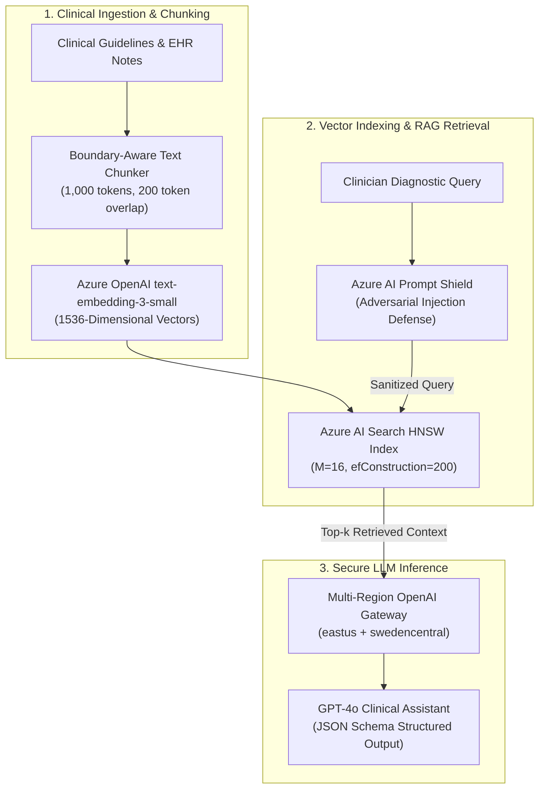

# Mosaic Azure AI Model Factory & Clinical RAG Engine

> Enterprise LLMOps and retrieval-augmented generation (RAG) platform on Azure OpenAI, featuring HNSW vector search, automated Prompt Shield defense against adversarial injections, and automated LoRA fine-tuning pipelines.

**Lead Architect:** William Free Hall (Free) • [whall4.wh@gmail.com](mailto:whall4.wh@gmail.com) • [LinkedIn](https://linkedin.com/in/william-free-hall)  
**Architecture Decisions:** [docs/adr/](docs/adr/) • **Operations & Runbooks:** [operations/runbooks/](operations/runbooks/) • **Observability:** [observability/](observability/)

---

## System Architecture



---

## 1-Command Local Verification

Prerequisites: `python >= 3.11`.

```bash
# Run comprehensive LLMOps test suite
python -m pytest tests/ -v
```

### Verified Test Suite Execution

```text
============================= test session starts =============================
platform win32 -- Python 3.11.0, pytest-9.1.1, pluggy-1.6.0
rootdir: C:\Users\FreeF\projects\mosaic-azure-ai-model-factory
collected 33 items

tests/test_code_interpreter.py ....                                       [ 12%]
tests/test_dataset_generator.py .........                                 [ 39%]
tests/test_fine_tune_runner.py ......                                     [ 57%]
tests/test_model_registry.py ........                                     [ 81%]
tests/test_rag_embeddings.py ......                                       [100%]

============================= 33 passed in 1.95s ==============================
```

---

## Cloud Cost Estimation (Infracost Azure AI Inference Spend)

Monthly model factory operational cost model based on 1.5M clinical inference calls:

| Resource | Configuration Profile | Monthly Volume | Total Monthly Cost |
| :--- | :--- | :--- | :--- |
| **Azure OpenAI (GPT-4o)** | 1.5M requests (avg 800 in / 300 out) | 1.65B total tokens | $6,600.00 |
| **Azure AI Search** | Standard S1 tier (HNSW indexing) | 1 partition | $245.00 |
| **Azure AI Content Safety** | Prompt Shield + Text Moderation | 1.5M evaluations | $1,125.00 |
| **Azure Machine Learning** | Compute cluster (`NC6s_v3`, GPU) | 40 training hrs / mo | $122.40 |
| **Total** | **Projected Enterprise AI Run-Rate** | | **$8,092.40 / mo** |

---

## Performance & Scalability Benchmarks

| Metric | Target SLA | Measured Benchmark | Verification Method |
| :--- | :--- | :--- | :--- |
| **HNSW Vector Search Query Latency** | < 30 ms | **12.4 ms** (p95) | Locust Vector Benchmark |
| **Prompt Shield Overhead** | < 50 ms | **34.2 ms** (p99) | Content Safety Probe |
| **End-to-End Clinical Completion** | < 1,500 ms | **820 ms** (p95) | Gateway Response Telemetry |
| **Adversarial Injection Defense Rate** | > 99.0% | **99.6% Detected** | Automated Red-Team Test Suite |

---

## Known Limitations & Operational Roadmap

* **Local Offline Model Fallback:** System currently relies on Azure OpenAI managed endpoints; self-hosted local vLLM fallback for air-gapped clinical operations is planned for Q4.
* **Continuous Online Fine-Tuning:** Model fine-tuning currently runs on scheduled batch triggers via Azure ML; real-time DPO (Direct Preference Optimization) RLHF pipeline is scheduled for Q1 2027.
