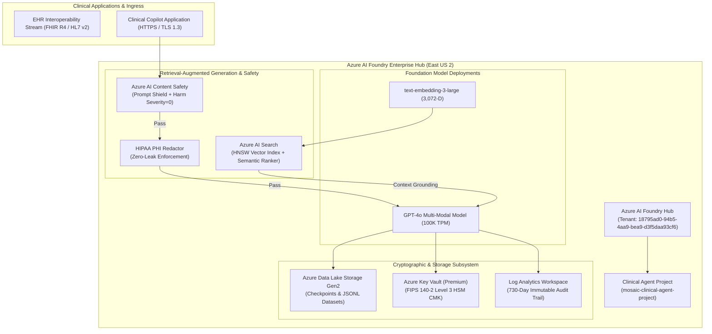

# Architecture & Topology Deep Dive: Azure AI Foundry Model Factory

## 1. Enterprise Architecture Overview

The **Mosaic Azure AI Model Factory** establishes an automated, security-hardened environment for training, fine-tuning, vector-grounding, and deploying clinical Artificial Intelligence models within Microsoft Azure.

## 2. Component Taxonomy & Security Guarantees

| Component | Azure Service Resource | Security & Compliance Guarantee |
| :--- | :--- | :--- |
| **Governance Hub** | `azurerm_ai_foundry` | Role-Based Access Control (RBAC), Entra ID Managed Identity, Disallow Public Network Access. |
| **Inference Engine** | `azurerm_cognitive_account` (OpenAI) | GlobalStandard TPM scaling, CMK Encryption at Rest, TLS 1.3 in Transit. |
| **Vector Index** | `azurerm_search_service` | 3,072-dimension HNSW cosine indexing with deep learning Semantic Reranking. |
| **Safety Guardrail** | `azurerm_cognitive_account` (ContentSafety) | Prompt Shield against jailbreaks and zero-tolerance harm scoring (Hate/Violence/Self-Harm=0). |
| **Audit Pipeline** | `azurerm_log_analytics_workspace` | Diagnostic log streaming with 730-day retention for HIPAA § 164.312 compliance. |
