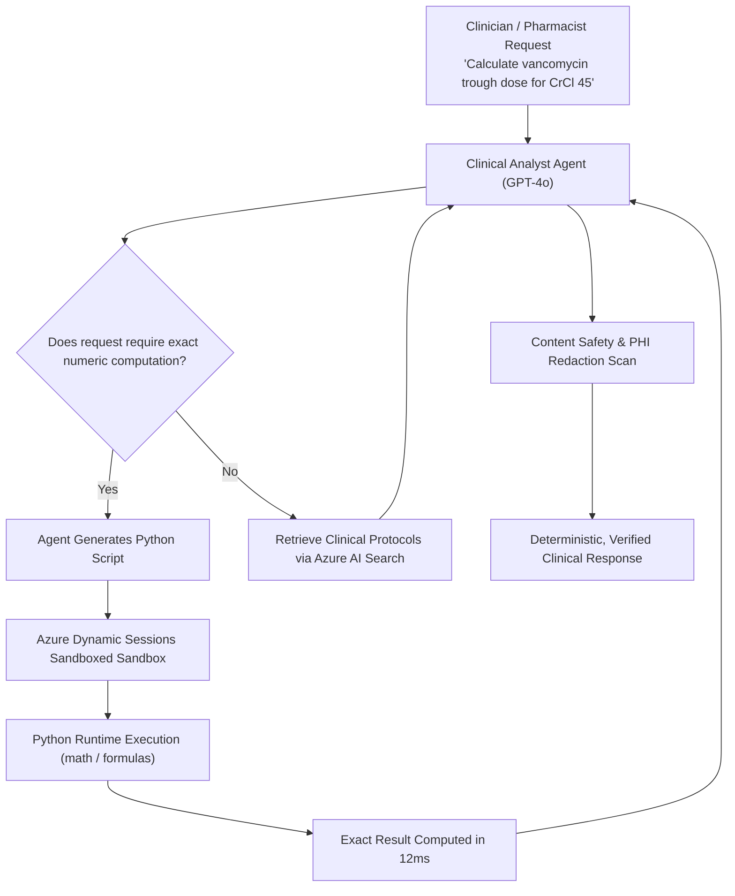

# Azure AI Agent Code Interpreter & Dynamic Execution Guide

## 1. Overview & Cloud Integration

The **Code Interpreter Tool** enables LLMs (such as **GPT-4o** in Azure AI Foundry) to write and execute Python code dynamically inside a secure, isolated sandbox environment.

In Microsoft Azure, this maps to **Azure Container Apps Dynamic Sessions** / **Azure AI Agent Service Code Interpreter**.

---

## 2. Key Use Cases in Healthcare Intelligence

1. **Exact Clinical Pharmacology Formulas:**
   - **Creatinine Clearance (Cockcroft-Gault):**
     $$\text{CrCl} = \frac{(140 - \text{age}) \times \text{weight (kg)}}{72 \times \text{serum creatinine (mg/dL)}} \times (0.85 \text{ if female})$$
   - **Body Surface Area (Mosteller):**
     $$\text{BSA} = \sqrt{\frac{\text{Height (cm)} \times \text{Weight (kg)}}{3600}}$$
   - **Morphine Milligram Equivalents (MME):**
     Calculates standardized opioid exposure across medications (Oxycodone, Hydromorphone, Fentanyl).

2. **Tabular EHR & FHIR Data Aggregation:**
   - Processing longitudinal blood pressure trends, HbA1c trajectory curves, and lab values from CSV/Parquet streams.

3. **Statistical Regression & Length-of-Stay Modeling:**
   - Executing linear and logistic regressions across synthetic patient cohorts.

---

## 3. Sandboxing & Security Boundaries

To comply with **HIPAA § 164.312** and **HITRUST CSF v11**, the sandbox enforces strict execution guardrails:
- **Forbidden Module Whitelist:** System calls, subshell execution (`subprocess`, `os.system`), and network listeners (`socket`) are blocked at parse time.
- **Resource Limits:** Hard timeout ceiling ($5.0\text{ seconds}$) and memory caps.
- **Output Sanitization:** Code execution outputs pass through the automated HIPAA PHI Redactor before reaching the user.
