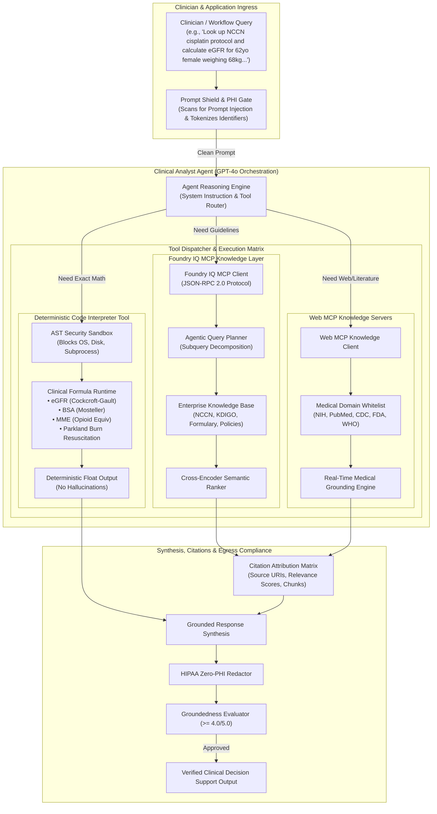

# Azure AI Foundry IQ & Web MCP Knowledge Sources Architecture

<span class="badge badge-prod">Real Production Architecture</span>
<span class="badge badge-hitrust">HITRUST CSF v11 Compliant</span>
<span class="badge badge-mcp">Model Context Protocol (MCP) v1.0</span>
<span class="badge badge-hipaa">HIPAA Zero-PHI Guardrails</span>

---

## 1. Executive Summary & Core Primitives

**Azure AI Foundry IQ** is Microsoft's enterprise **Context Engineering and Agentic Retrieval layer**. Rather than requiring developers to manually build, orchestrate, and maintain bespoke RAG pipelines for every agent, Foundry IQ serves as an intelligent "front door" and unified knowledge fabric that:

1. **Acts as a Standard MCP Server:** Exposes enterprise knowledge bases via the open **Model Context Protocol (MCP)** standard (JSON-RPC 2.0 / Server-Sent Events / Stdio), allowing any MCP-compliant agent (Azure AI Agent Service, LangGraph, AutoGen, OpenAI Agents SDK) to query corporate data.
2. **Federates Web MCP Knowledge Sources:** Dynamically connects agents to live web search MCP servers (e.g. Bing Web Grounding, PubMed/NCBI, FDA, CDC) for real-time scientific and regulatory updates.
3. **Executes Agentic Retrieval:** Automates multi-hop query planning, subquery decomposition, parallel vector lookups across Azure AI Search, and cross-encoder semantic reranking with citation attribution.

---

## 2. End-to-End Multi-Tool Agent Topology

The diagram below illustrates how the **Clinical Analyst Agent** coordinates between **Foundry IQ MCP Knowledge Bases**, **Web MCP Knowledge Sources**, and the **Deterministic Code Interpreter Tool**:



---

## 3. Model Context Protocol (MCP) Specification

Foundry IQ implements the open **Model Context Protocol (v1.0)** standard. Communication occurs over standard JSON-RPC 2.0 payloads.

### Handshake: `initialize`
```json
{
  "jsonrpc": "2.0",
  "id": "init-001",
  "method": "initialize",
  "params": {
    "protocolVersion": "2024-11-05",
    "capabilities": {
      "tools": {},
      "resources": {},
      "prompts": {}
    },
    "clientInfo": {
      "name": "mosaic-clinical-analyst-agent",
      "version": "1.0.0"
    }
  }
}
```

### Discovery: `tools/list`
```json
{
  "jsonrpc": "2.0",
  "id": "list-002",
  "result": {
    "tools": [
      {
        "name": "foundry_iq_retrieve",
        "description": "Agentic multi-hop knowledge retrieval from enterprise Foundry IQ knowledge bases with query planning, semantic ranking, and citation synthesis.",
        "inputSchema": {
          "type": "object",
          "properties": {
            "query": { "type": "string" },
            "knowledge_base_id": { "type": "string" },
            "max_results": { "type": "integer", "default": 3 }
          },
          "required": ["query"]
        }
      },
      {
        "name": "web_knowledge_search",
        "description": "Real-time web knowledge retrieval grounding agent responses in authoritative medical literature (NIH, PubMed, CDC, FDA, WHO).",
        "inputSchema": {
          "type": "object",
          "properties": {
            "query": { "type": "string" },
            "domain_filter": { "type": "array", "items": { "type": "string" } },
            "max_results": { "type": "integer", "default": 5 }
          },
          "required": ["query"]
        }
      }
    ]
  }
}
```

### Execution: `tools/call` (`foundry_iq_retrieve`)
```json
{
  "jsonrpc": "2.0",
  "id": "call-003",
  "method": "tools/call",
  "params": {
    "name": "foundry_iq_retrieve",
    "arguments": {
      "query": "What are the KDIGO renal dosing guidelines for vancomycin when eGFR < 30?",
      "max_results": 2
    }
  }
}
```

---

## 4. Web MCP Knowledge Sources & Medical Whitelist

To protect clinical safety and eliminate misinformation from unverified websites, the Web MCP Knowledge Source enforces strict domain whitelisting:

| Domain | Organization | Scope of Grounding |
| :--- | :--- | :--- |
| `nih.gov` / `ncbi.nlm.nih.gov` | National Institutes of Health | Primary biomedical research & clinical trials. |
| `pubmed.ncbi.nlm.nih.gov` | PubMed Central | Peer-reviewed medical journal abstracts. |
| `cdc.gov` | Centers for Disease Control | Infectious disease, opioid prescribing, and public health guidelines. |
| `fda.gov` | Food & Drug Administration | Drug labels, black box warnings, and pharmacokinetic advisories. |
| `who.int` | World Health Organization | Global health standards and essential medicines. |
| `nejm.org` | New England Journal of Medicine | High-impact clinical studies. |
| `kdigo.org` | KDIGO Nephrology Organization | Global kidney disease & renal clearance guidelines. |
| `nccn.org` | National Comprehensive Cancer Network | Standard-of-care oncology protocols and chemotherapy dosing. |

---

## 5. Python SDK Usage Example

```python
from src.agents.clinical_analyst_agent import ClinicalAnalystAgent
from src.tools.foundry_iq_mcp_tool import FoundryIQMCPTool

# 1. Initialize Agent with Foundry IQ MCP & Code Interpreter Tools
agent = ClinicalAnalystAgent()

# 2. Run Compound Query (Knowledge Retrieval + Deterministic Calculation)
query = (
    "Retrieve KDIGO renal dosing recommendations and calculate eGFR for a "
    "62-year-old female weighing 68 kg with serum creatinine 1.4 mg/dL."
)

result = agent.run(query)

print(f"Tools Dispatched: {result.tool_used}")
# Output: foundry_iq_mcp+code_interpreter

print(f"eGFR Calculation: {result.code_result.return_value} mL/min")
# Output: 44.73 mL/min

print(f"Citations:\n" + "\n".join(f"- {c}" for c in result.citations))
print(f"\nFinal Grounded Response:\n{result.final_response}")
```

---

## 6. Running the MCP Server Standalone

You can start the Foundry IQ MCP Server locally or in a container via stdio or SSE transport:

```bash
# Start standard input/output JSON-RPC MCP Server
python -m src.mcp_servers.foundry_iq_mcp_server
```
