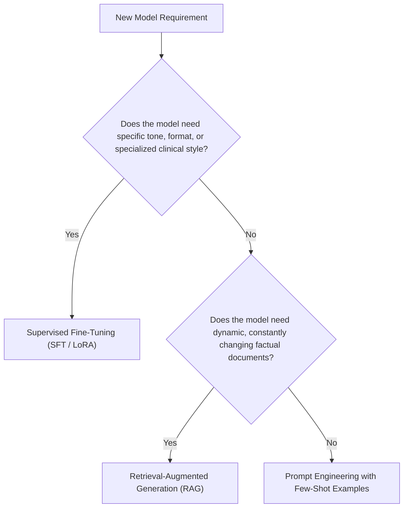

# Model Fine-Tuning Playbook: Azure AI Foundry (LoRA & SFT)

## 1. When to Fine-Tune vs. When to Use RAG



## 2. Fine-Tuning Workflow Steps

1. **Prepare Synthetic JSONL Dataset:**
   ```json
   {"messages": [{"role": "system", "content": "You are a clinical decision support assistant adhering to Mosaic protocols."}, {"role": "user", "content": "What is the stroke treatment window?"}, {"role": "assistant", "content": "IV Alteplase is indicated within 4.5 hours of verified symptom onset."}]}
   ```
2. **Configure Hyperparameters:**
   - `n_epochs`: 3 to 5 epochs for domain adaptation without catastrophic forgetting.
   - `batch_size`: 4 to 8 for gradient stability.
   - `learning_rate_multiplier`: 0.8 to 1.2.
3. **Execute Training:**
   ```bash
   python -m src.fine_tuning.fine_tune_runner
   ```
4. **Deploy Fine-Tuned Checkpoint:**
   Deploy the fine-tuned model checkpoint into Azure AI Foundry and assign TPM capacity.
