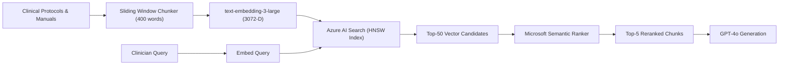

# RAG & Semantic Vector Search Guide: Azure AI Search

## 1. Vector Search Pipeline Architecture

## 2. Index Configuration Reference

- **Vector Algorithm:** `HNSW` (Hierarchical Navigable Small World) with Cosine Metric.
- **Parameters:** `m=4`, `efConstruction=400`, `efSearch=500`.
- **Dimensions:** 3,072 dimensions matching `text-embedding-3-large`.
- **Semantic Configuration:** Prioritized fields (`title`, `content`) for deep learning re-ranking.
